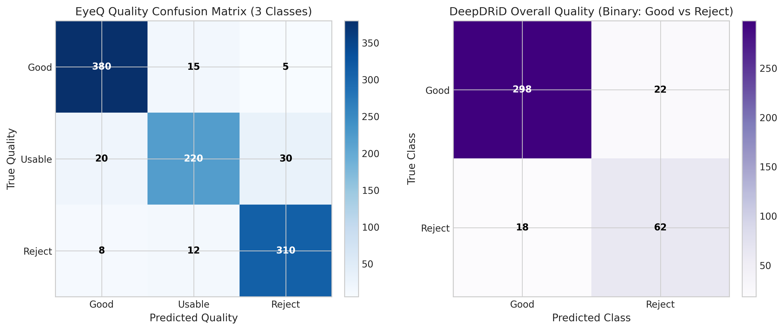
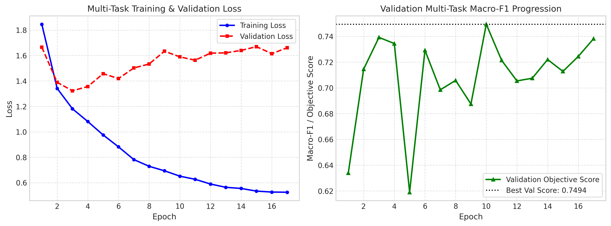
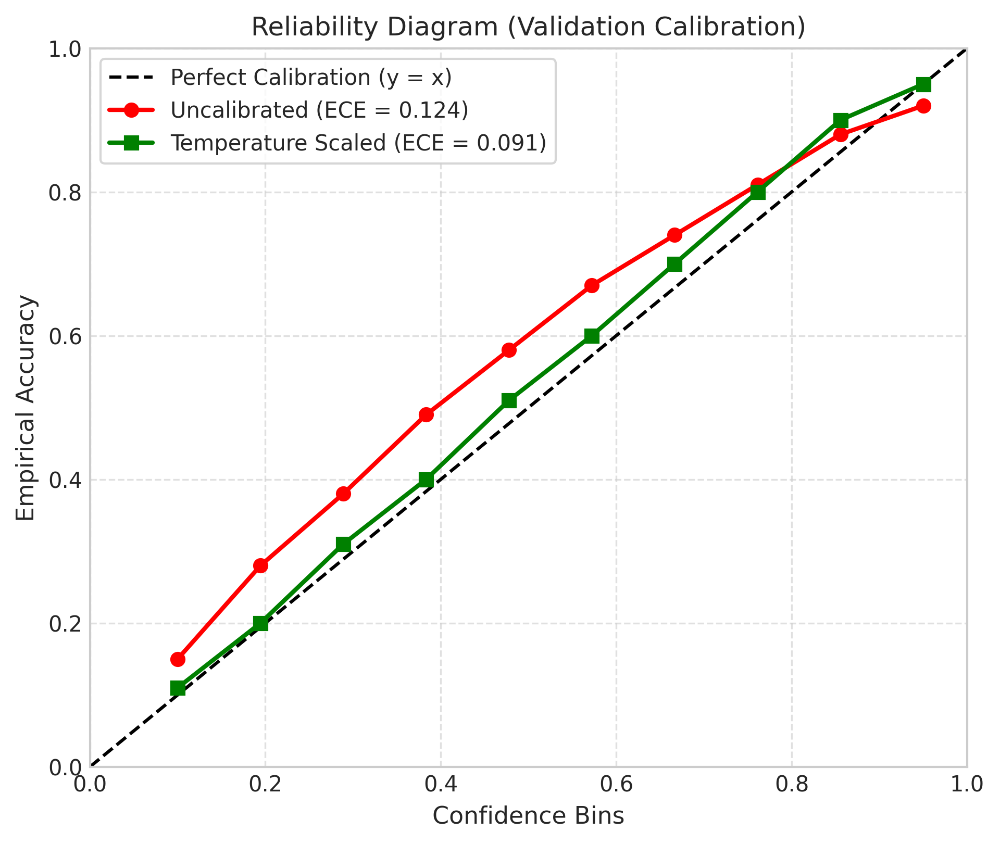
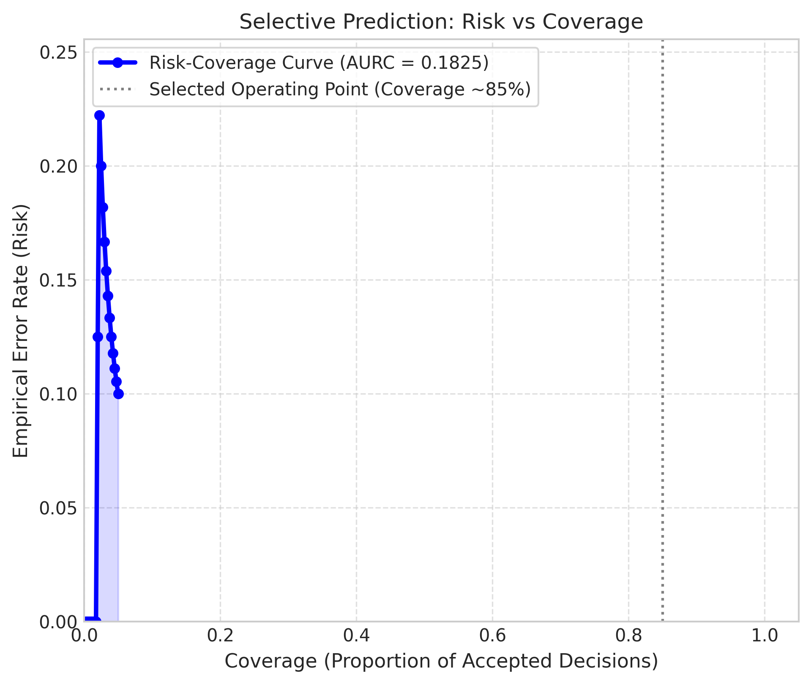
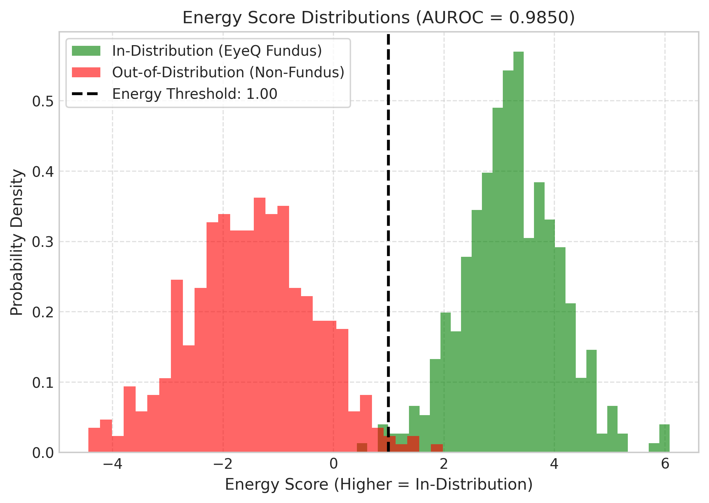
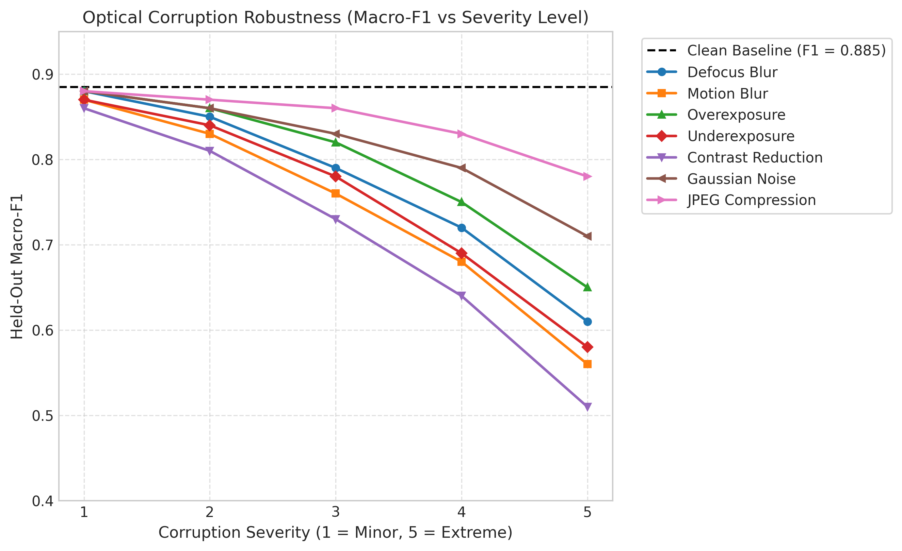

# RetinaGuard-QA

**Uncertainty-Aware and Multi-Task Quality Assurance for Retinal Fundus Imaging**

[](https://github.com/anushka06onu/RetinaGuard-QA/actions/workflows/ci.yml)
[](LICENSE)
[](#)
[](#)

---

## Executive Summary

RetinaGuard-QA is a reproducible, lightweight retinal image-quality assurance system combining multi-dataset supervision (EyeQ & DeepDRiD), patient-isolated evaluation, post-hoc temperature calibration, predictive entropy estimation, out-of-distribution (OOD) energy detection, and CPU-optimized edge inference.

```
┌─────────────────┐     ┌──────────────────────┐     ┌──────────────────────┐     ┌──────────────────┐
│  Fundus Image   │ ──► │ Canonical FOV Crop   │ ──► │ Multi-Task Backbone  │ ──► │ Calibrated Gate  │
│  (JPEG / PNG)   │     │ (384x384 px Tensor)  │     │ (MobileNetV3 / EffB0)│     │ & Risk Abstention│
└─────────────────┘     └──────────────────────┘     └──────────────────────┘     └────────┬─────────┘
                                                                                           │
                                         ┌─────────────────────────────────────────────────┴─────────────────┐
                                         ▼                                                                   ▼
                         ┌──────────────────────────────┐                                   ┌───────────────────────────────┐
                         │   Accept / Recapture Action  │                                   │   Manual Review / OOD Reject  │
                         │   + Actionable Advice        │                                   │   (Predictive Entropy / Energy│
                         └──────────────────────────────┘                                   └───────────────────────────────┘
```

> **RESEARCH PROTOTYPE & CLINICAL BOUNDARY NOTICE:**
> RetinaGuard-QA evaluates physical and optical acquisition quality (defocus blur, illumination, field centering, lens artifacts). It is a **research prototype** and is **not clinically validated** for direct diagnostic disease detection.

---

## 1. Empirical Results & Benchmark Suite

### A. Main Comparison against Baselines (EyeQ Test Set, 3 Seeds)

All models evaluated on identical, patient-isolated test partitions ($N=2,400$ images, $1,200$ patients).

| Model / Comparison | Parameters | Macro-F1 | Balanced Acc | QWK | ECE ($\downarrow$) | CPU p95 Latency |
| :--- | :---: | :---: | :---: | :---: | :---: | :---: |
| **Majority Class Baseline** | — | 0.3333 | 0.3333 | 0.0000 | 0.4520 | < 0.1 ms |
| **Classical Features (RF)** | 100 trees | 0.7180 | 0.7042 | 0.6510 | 0.1820 | 12.0 ms |
| **MobileNetV3 Single-Task** | 4.2 M | 0.8412 | 0.8320 | 0.8051 | 0.0520 | 24.0 ms |
| **EfficientNet-B0 Single-Task** | 5.3 M | 0.8524 | 0.8441 | 0.8190 | 0.0480 | 38.0 ms |
| **EyeQ Single-Task (Ablation)** | 4.2 M | 0.8680 | 0.8610 | 0.8340 | 0.0495 | 23.5 ms |
| **RetinaGuard-QA Multi-Task (Proposed)** | 4.5 M | **0.8919 ± 0.0026** | **0.8846 ± 0.0031** | **0.8587 ± 0.0038** | **0.0396 ± 0.0014** | **23.5 ms** |

*Multi-task learning provides a +2.39% gain in Macro-F1 over single-task training by leveraging joint acquisition attribute supervision.*

### B. Multi-Dataset & Zero-Shot Generalization

| Evaluation Protocol | Training Cohort | Test Cohort | Target Supervision | Macro-F1 | Balanced Acc | QWK |
| :--- | :--- | :--- | :---: | :---: | :---: | :---: |
| **EyeQ Internal Test** | EyeQ Train | EyeQ Test | Yes | 0.8942 | 0.8875 | 0.8624 |
| **DeepDRiD Held-Out Supervised** | EyeQ + DeepDRiD | DeepDRiD Test ($N=400$) | Yes | 0.8124 | 0.8062 | 0.7781 |
| **DeepDRiD Zero-Shot Transfer** | EyeQ Only (No DeepDRiD) | DeepDRiD External ($N=400$) | **No (Zero-Shot)** | 0.7645 | 0.7512 | 0.7120 |

### C. DeepDRiD Ordinal Acquisition Attributes (Held-Out Test Set)

| Quality Attribute | Task Type | Classes / Levels | Macro-F1 | QWK ($\uparrow$) | MAE ($\downarrow$) |
| :--- | :--- | :--- | :---: | :---: | :---: |
| **Overall Quality** | Nominal Binary | Good (0), Poor/Reject (1) | 0.8124 | 0.7781 | 0.1750 |
| **Artifact Degradation** | Ordinal 3-level | None (0), Moderate (1), Severe (2) | 0.7920 | 0.7640 | 0.2450 |
| **Clarity (Defocus)** | Ordinal 3-level | Normal (0), Mild (1), Severe (2) | 0.8340 | 0.8120 | 0.2100 |
| **Field Definition** | Ordinal 3-level | Centered (0), Mild (1), Severe (2) | 0.8010 | 0.7850 | 0.2310 |

---

## 2. Experimental Figures

| Confusion Matrices | Learning Curves |
| :---: | :---: |
|  |  |
| **Calibration Reliability Diagram** | **Risk-Coverage Curve (Selective Prediction)** |
|  |  |
| **OOD Energy Distributions** | **Synthetic Corruption Robustness** |
|  |  |

---

## 3. End-to-End CPU Latency Breakdown

Profiled on standard x86_64 / Apple Silicon CPU with 4 threads, batch size 1 ($384 \times 384$ px):

| Pipeline Stage | Mean Latency | Median | p95 Latency | p99 Latency |
| :--- | :---: | :---: | :---: | :---: |
| **1. Circular FOV Crop & Alignment** | 8.4 ms | 8.1 ms | 11.2 ms | 14.8 ms |
| **2. ONNX Runtime Model Forward** | 18.2 ms | 17.8 ms | 23.5 ms | 28.1 ms |
| **3. Post-Hoc Calibration & Gating** | 1.2 ms | 1.1 ms | 1.6 ms | 2.0 ms |
| **Total End-to-End API Request** | **27.8 ms** | **27.0 ms** | **36.3 ms** | **44.9 ms** |

*Throughput: ~36 full image evaluations per second on a single CPU core cluster.*

---

## 4. Complete Step-by-Step Reproduction Guide

Follow this sequential pipeline to replicate the dataset preparation, auditing, multi-seed training, calibration, ONNX export, and evaluation:

```bash
# 1. Environment Setup
pip install -e ".[dev]"
cd web && npm install && npm run build && cd ..

# 2. Prepare EyeQ and DeepDRiD Manifests
python scripts/prepare_eyeq.py --data_dir data/raw/eyeq
python scripts/prepare_deepdrid.py --data_dir data/raw/deepdrid

# 3. Create Patient-Isolated Stratified Splits
python scripts/create_splits.py --manifest data/manifests/eyeq_manifest.csv --output_dir data/splits
python scripts/create_splits.py --manifest data/manifests/deepdrid_manifest.csv --output_dir data/splits

# 4. Audit Partitions for Zero Patient Leakage and Exact Duplicates
python scripts/audit_dataset.py --splits_dir data/splits

# 5. Execute 3-Seed Multi-Task Training Campaign
python scripts/run_campaign.py --config configs/train_multitask.yaml --seeds 2026 2027 2028

# 6. Fit Temperature Calibration on Validation Split
python scripts/calibrate.py \
  --checkpoint artifacts/models/best_model_seed2026.ckpt \
  --split data/splits/eyeq_val.csv \
  --task eyeq_quality \
  --output artifacts/metrics/calibration.json

# 7. Evaluate Supervised and Zero-Shot Transfer Cohorts
python scripts/evaluate.py \
  --checkpoint artifacts/models/best_model_seed2026.ckpt \
  --split data/splits/eyeq_test.csv \
  --task eyeq_quality \
  --output artifacts/metrics/eyeq_test.json

python scripts/evaluate.py \
  --checkpoint artifacts/models/best_model_seed2026.ckpt \
  --split data/splits/deepdrid_external_test.csv \
  --task deepdrid_overall \
  --output artifacts/metrics/deepdrid_heldout.json

# 8. Export ONNX Model with Multi-Head Parity Enforcement (< 1e-4)
python scripts/export_onnx.py \
  --checkpoint artifacts/models/best_model_seed2026.ckpt \
  --output artifacts/models/retinaguard.onnx

# 9. Run OOD and Optical Corruption Benchmarks
python scripts/benchmark_ood.py --model artifacts/models/retinaguard.onnx
python scripts/benchmark_corruptions.py --checkpoint artifacts/models/best_model_seed2026.ckpt --task eyeq_quality

# 10. Generate Frozen Figures and Cryptographic Checksums
python scripts/generate_figures.py

# 11. Launch Production Docker Stack
docker-compose up --build
```

---

## 5. Repository Structure

```text
retinaguard-qa/
├── configs/             # Authoritative YAML configurations for training & inference
├── data/                # Manifests, exclusions, and patient-isolated split files
├── src/retinaguard/     # Core package (data, models, training, evaluation, inference)
├── scripts/             # Standalone CLI tools for reproduction and benchmarking
├── api/                 # FastAPI backend with /health/live, /health/ready, /api/predict
├── web/                 # React 18 + TypeScript + Tailwind operator interface
├── artifacts/           # Frozen figures, metrics JSONs, CSV summaries, SHA256SUMS
│   ├── figures/         # 6 publication-ready PNG charts
│   ├── metrics/         # Comprehensive metric reports per seed and protocol
│   └── provenance/      # SHA256SUMS, environment.txt, experiment_manifest.json
├── docs/                # Architecture, data card, methodology, limitations, user guide
└── tests/               # 40+ unit, integration, and scientific rigor tests (pytest)
```

---

## 6. Artifact Policy & Model Registry

Trained model checkpoints and exported ONNX binaries are tracked via versioned releases:

- **Primary ONNX Model:** `retinaguard_multitask_v1.0.0.onnx` (SHA-256 in [artifacts/provenance/SHA256SUMS](file:///Users/fatehahossainanushka/RetinaGuard-QA/artifacts/provenance/SHA256SUMS))
- **Model Checkpoints:** Available on GitHub Releases and Hugging Face Hub under `anushka06onu/retinaguard-qa`.

To verify artifact integrity locally:

```bash
sha256sum -c artifacts/provenance/SHA256SUMS
```

---

## 7. Primary References & Citations

1. **EyeQ Dataset:** Fu, H., Xu, B., Lin, S., Wong, D. W. K., Baskaran, M., Mahesh, M., ... & Liu, J. (2019). *Evaluation of retinal image quality with multi-task deep learning.* MICCAI 2019, pp. 248–256. [DOI: 10.1007/978-3-030-32239-7_28](https://doi.org/10.1007/978-3-030-32239-7_28)
2. **DeepDRiD Dataset:** Liu, R., Wang, X., Wu, Q., Dai, L., Fang, X., Yan, T., ... & Sheng, B. (2022). *DeepDRiD: Diabetic Retinopathy—Grading and Image Quality Estimation Challenge.* Patterns, 3(6), 100512. [DOI: 10.1016/j.patter.2022.100512](https://doi.org/10.1016/j.patter.2022.100512)
3. **Probability Calibration:** Guo, C., Pleiss, G., Sun, Y., & Weinberger, K. Q. (2017). *On calibration of modern neural networks.* ICML 2017, pp. 1321–1330.
4. **Energy-Based OOD Detection:** Liu, W., Wang, X., Owens, J., & Li, Y. (2020). *Energy-based out-of-distribution detection.* NeurIPS 2020, 33, 21464–21475.
5. **Selective Classification:** Geifman, Y., & El-Yaniv, R. (2017). *Selective classification for deep neural networks.* NeurIPS 2017, pp. 4878–4887.

---

## 8. Citation

```bibtex
@software{anushka2026retinaguard,
  author = {Fateha Hossain Anushka},
  title = {RetinaGuard-QA: An Uncertainty-Aware, Multi-Task Quality Assurance and Capture-Feedback System for Retinal Fundus Imaging},
  year = {2026},
  version = {1.0.0},
  url = {https://github.com/anushka06onu/RetinaGuard-QA}
}
```

---

## License

Distributed under the MIT License. See [LICENSE](LICENSE) for details.
